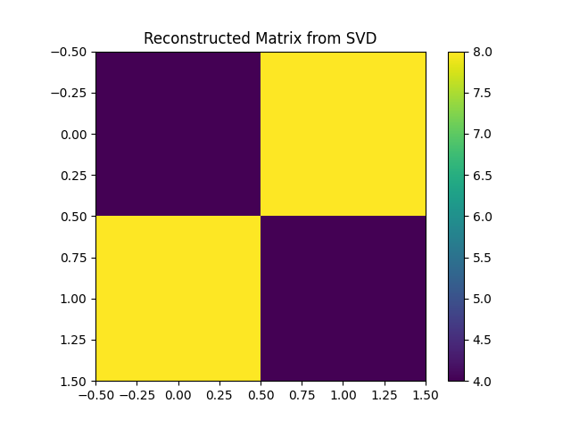
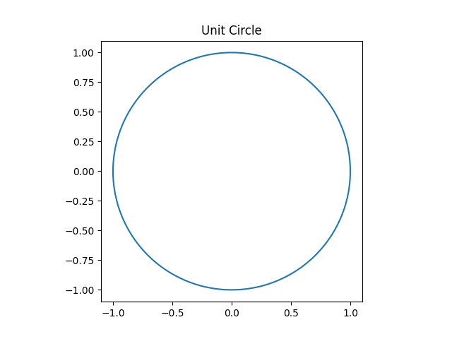

# Singular Value Decomposition (SVD)

  
  

  
  

  

---

## Introduction

Singular Value Decomposition (SVD) is a powerful matrix factorization technique used in Linear Algebra and Machine Learning.

It decomposes any matrix **A (m × n)** into three matrices:

    A = U Σ Vᵀ

Where:

- U  = Left singular vectors (orthogonal matrix)
- Σ  = Diagonal matrix containing singular values
- Vᵀ = Transpose of right singular vectors (orthogonal matrix)

SVD works for both square and rectangular matrices.

---

## Mathematical Representation

For a matrix A:

    A = U Σ Vᵀ

Where:

- Columns of U are eigenvectors of A Aᵀ
- Columns of V are eigenvectors of Aᵀ A
- Singular values (σᵢ) = √(eigenvalues of Aᵀ A)

---

# Algorithm: Singular Value Decomposition

## Input:
    A = m × n matrix

## Output:
    U, Σ, Vᵀ matrices

---

## Steps:

1. Compute AᵀA

2. Find eigenvalues and eigenvectors of AᵀA

3. Compute singular values:

       σᵢ = √(λᵢ)

   (λᵢ are eigenvalues of AᵀA)

4. Form matrix V using normalized eigenvectors

5. Compute U using:

       uᵢ = (1 / σᵢ) A vᵢ

6. Construct Σ matrix with singular values on diagonal

7. Final decomposition:

       A = U Σ Vᵀ

---

## Example Used in This Project

Original Matrix:

    A = [[4, 8],
         [8, 4]]

SVD Decomposition Result:

    U =
    [[-0.70710678  -0.70710678]
     [-0.70710678   0.70710678]]

    Σ =
    [[12.  0.]
     [ 0.  4.]]

    Vᵀ =
    [[-0.70710678  -0.70710678]
     [ 0.70710678  -0.70710678]]

Reconstructed Matrix:

    [[4. 8.]
     [8. 4.]]

This verifies:

    A = U Σ Vᵀ

---

## Applications of SVD

- Dimensionality Reduction
- Principal Component Analysis (PCA)
- Image Compression
- Noise Reduction
- Recommendation Systems
- Natural Language Processing

---

## Time Complexity

For an m × n matrix:

    O(min(mn², m²n))

---

## Space Complexity

    O(mn)

---

## Conclusion

Singular Value Decomposition is one of the most important matrix factorization techniques in mathematics and machine learning.

It provides:

- Optimal low-rank approximation
- Numerical stability
- Strong theoretical foundation
- Wide practical applications

SVD is fundamental for advanced topics like PCA, data compression, and deep learning.