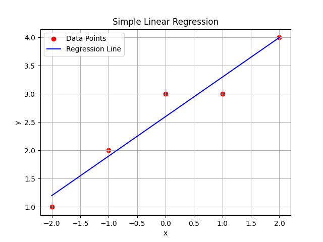

# Linear Regression

  

## Introduction

Linear Regression is a supervised machine learning algorithm used for predicting a continuous target variable.  
It models the relationship between an independent variable (X) and a dependent variable (Y) using a linear equation.

The goal of Linear Regression is to find the best-fit straight line that minimizes the error between predicted and actual values.  
This is typically achieved using the **Least Squares Method**.

The equation of a simple linear regression line is:

    Y = b0 + b1X

Where:
- b0 = Intercept
- b1 = Slope (coefficient)
- X  = Input feature
- Y  = Predicted output

---

# Algorithm: SimpleLinearRegression (Using Least Squares Method)

## Input:
    D = Training dataset containing pairs (Xi, Yi)
    X_new = New input value

## Output:
    Predicted value Y_pred

---

## Steps:

1. Let:
       n ← total number of data points

2. Compute summations:
       sumX  ← Σ Xi
       sumY  ← Σ Yi
       sumXY ← Σ (Xi × Yi)
       sumX2 ← Σ (Xi²)

3. Compute slope (b1):

       b1 ← (n × sumXY − sumX × sumY) / (n × sumX2 − (sumX)²)

4. Compute intercept (b0):

       b0 ← (sumY − b1 × sumX) / n

5. Form the regression equation:

       Y = b0 + b1X

6. For new input X_new, compute prediction:

       Y_pred ← b0 + b1 × X_new

7. Return Y_pred

---

## Mathematical Objective

Linear Regression minimizes the cost function:

       J(b0, b1) = (1/n) Σ (Yi − Ŷi)²

This is called the **Mean Squared Error (MSE)**.

---

## Assumptions

- Linear relationship between X and Y
- No multicollinearity (for multiple regression)
- Homoscedasticity (constant variance of errors)
- Errors are normally distributed

---

## Time Complexity

Training: O(n)  
Prediction: O(1)

Where:
    n = number of data points

---

## Space Complexity

O(1)

---

## Conclusion

Linear Regression is a simple and powerful algorithm for regression tasks.  
It is widely used in predictive modeling, forecasting, and statistical analysis due to its interpretability and efficiency.

