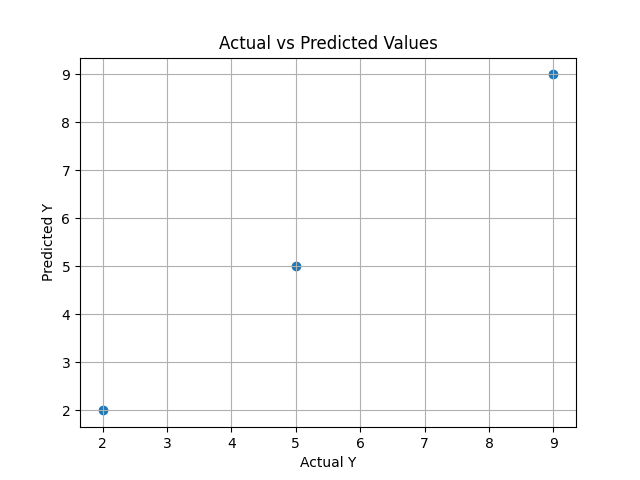

# Multiple Regression

  
  

## Introduction

Multiple Regression is a supervised learning algorithm used to predict a continuous dependent variable using more than one independent variable.

It extends Simple Linear Regression by considering multiple input variables to improve prediction accuracy.

The general form of the equation is:

    Y = b0 + b1X1 + b2X2 + ... + bnXn

Where:
- Y  = Dependent variable
- X1, X2, ..., Xn = Independent variables
- b0 = Intercept
- b1, b2, ..., bn = Regression coefficients

The objective is to estimate the coefficients such that the total squared error is minimized.

---

# Algorithm: MultipleRegression (Without Matrix Method)

## Input:
    D = Dataset with n samples and m features
    (Xi1, Xi2, ..., Xim, Yi)
    X_new = New input values (X1, X2, ..., Xm)

## Output:
    Predicted value Y_pred

---

## Steps:

1. Let:
       n ← number of samples
       m ← number of independent variables

2. Compute required summations for each feature:
       ΣXi
       ΣYi
       ΣXiYi
       ΣXiXj   (for interaction between variables)

3. Form normal equations using Least Squares method.

   For two variables (X1 and X2), equations become:

       ΣY  = nb0 + b1ΣX1 + b2ΣX2
       ΣX1Y = b0ΣX1 + b1ΣX1² + b2ΣX1X2
       ΣX2Y = b0ΣX2 + b1ΣX1X2 + b2ΣX2²

4. Solve the simultaneous equations to compute:
       b0, b1, b2, ..., bn

5. Form regression equation:

       Y = b0 + b1X1 + b2X2 + ... + bnXn

6. For new input X_new:

       Y_pred = b0 + b1X1 + b2X2 + ... + bnXn

7. Return Y_pred

---

## Cost Function

The algorithm minimizes the Sum of Squared Errors (SSE):

       SSE = Σ (Yi − Ŷi)²

Where:
- Yi  = Actual value
- Ŷi  = Predicted value

---

## Assumptions

- Linear relationship between dependent and independent variables
- No strong multicollinearity
- Constant variance of errors
- Independent observations

---

## Time Complexity

    O(nm)

Where:
- n = number of samples
- m = number of features

---

## Space Complexity

    O(m)

---

## Conclusion

Multiple Regression improves prediction performance by incorporating multiple input variables.  
It is widely used in economics, finance, data analytics, and predictive modeling.
