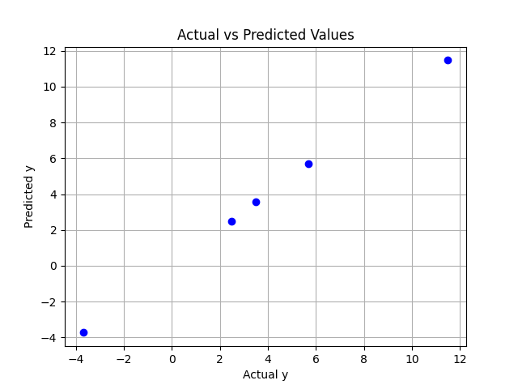
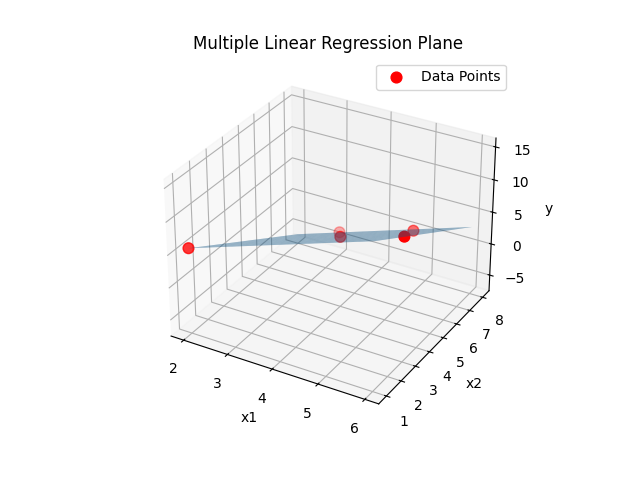

# Multiple Linear Regression

  
  

## Introduction

Multiple Linear Regression is a supervised machine learning algorithm used to predict a continuous dependent variable using two or more independent variables.

It extends Simple Linear Regression by modeling the relationship between multiple input features and a single output variable.

The mathematical model is:

    Y = b0 + b1X1 + b2X2 + ... + bmXm

Where:
- Y  = Dependent variable (target)
- X1, X2, ..., Xm = Independent variables (features)
- b0 = Intercept
- b1, b2, ..., bm = Regression coefficients

The objective is to determine optimal coefficients that minimize the prediction error using the **Least Squares Method**.

---

# Algorithm: MultipleLinearRegression

## Input:
    D = Training dataset with n samples and m features
    X_new = New feature vector (X1, X2, ..., Xm)

## Output:
    Predicted value Y_pred

---

## Steps:

1. Let:
       n ← number of training samples
       m ← number of features

2. Construct the Design Matrix X:
       Add a column of 1s to represent intercept term (b0)

3. Represent output values as vector Y.

4. Compute coefficient vector B using Normal Equation:

       B = (XᵀX)^(-1) XᵀY

   Where:
       Xᵀ = Transpose of matrix X
       B  = (b0, b1, b2, ..., bm)

5. Form regression equation:

       Y = b0 + b1X1 + b2X2 + ... + bmXm

6. For new input X_new, compute:

       Y_pred = b0 + b1X1 + b2X2 + ... + bmXm

7. Return Y_pred

---

## Cost Function

The algorithm minimizes the Mean Squared Error (MSE):

       J(B) = (1/n) Σ (Yi − Ŷi)^2

Where:
- Yi  = Actual value
- Ŷi  = Predicted value

---

## Assumptions

- Linear relationship between dependent and independent variables
- No strong multicollinearity among features
- Homoscedasticity (constant error variance)
- Errors are normally distributed

---

## Time Complexity

Using Normal Equation:

    O(m³)

Where:
- m = number of features

---

## Space Complexity

    O(m²)

---

## Conclusion

Multiple Linear Regression is widely used in predictive analytics and statistical modeling.  
It provides interpretable coefficients and performs well when relationships between variables are linear.
