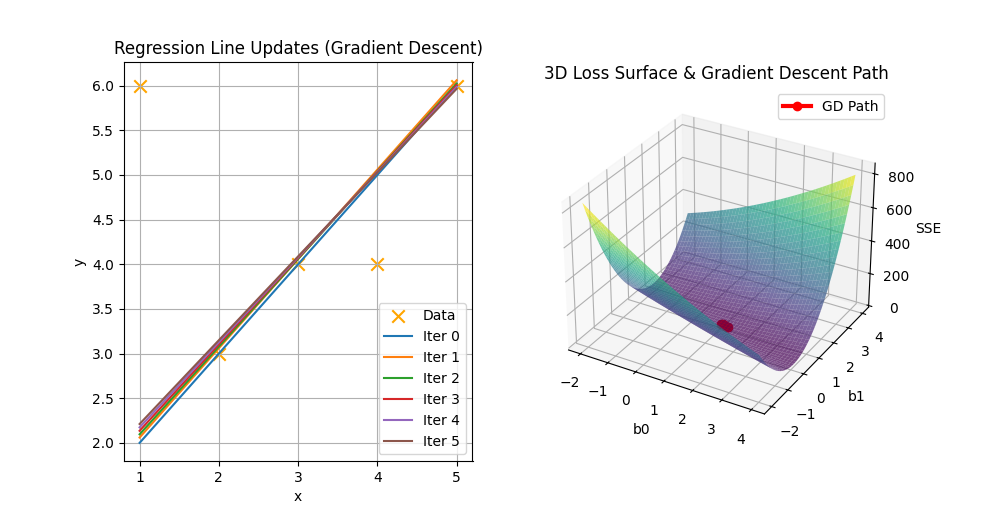

# Linear Regression using Gradient Descent

  

## Introduction

Gradient Descent is an optimization algorithm used to minimize the cost function in machine learning models.

In Linear Regression, Gradient Descent is used to find the optimal values of parameters (b0, b1) by iteratively updating them in the direction that reduces prediction error.

Instead of using the Normal Equation, Gradient Descent updates parameters step-by-step until convergence.

The regression equation is:

    Y = b0 + b1X

Where:
- Y  = Predicted value
- X  = Input feature
- b0 = Intercept
- b1 = Slope

---

# Algorithm: LinearRegression_GradientDescent

## Input:
    D = Training dataset (Xi, Yi)
    α = Learning rate
    epochs = Number of iterations
    X_new = New input value

## Output:
    Optimized parameters (b0, b1)
    Predicted value Y_pred

---

## Steps:

1. Initialize parameters:
       b0 ← 0
       b1 ← 0

2. Let:
       n ← number of training samples

3. Repeat for given number of epochs:

       a. Compute predicted values:
              Ŷi = b0 + b1Xi

       b. Compute gradients:

              ∂J/∂b0 = (-2/n) Σ (Yi − Ŷi)
              ∂J/∂b1 = (-2/n) Σ Xi(Yi − Ŷi)

       c. Update parameters:

              b0 ← b0 − α * (∂J/∂b0)
              b1 ← b1 − α * (∂J/∂b1)

4. After convergence, form regression equation:

       Y = b0 + b1X

5. For new input X_new:

       Y_pred = b0 + b1X_new

6. Return Y_pred

---

## Cost Function

The objective is to minimize Mean Squared Error (MSE):

       J(b0, b1) = (1/n) Σ (Yi − Ŷi)²

Gradient Descent reduces this cost iteratively.

---

## Key Concepts

- Learning Rate (α):
  Controls step size of parameter updates.
  Too large → divergence
  Too small → slow convergence

- Epochs:
  Number of iterations over dataset.

---

## Time Complexity

    O(n × epochs)

Where:
- n = number of training samples

---

## Space Complexity

    O(1)

---

## Conclusion

Gradient Descent is an efficient optimization technique for large datasets where Normal Equation becomes computationally expensive.

It is widely used in deep learning and large-scale regression problems.
