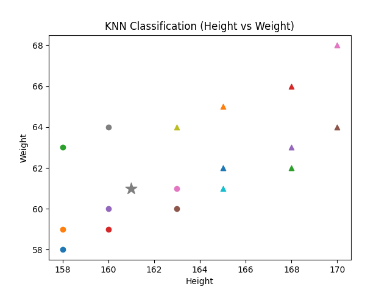

# K-Nearest Neighbors (KNN) Classification

  

## Introduction

K-Nearest Neighbors (KNN) is a supervised machine learning algorithm used for classification and regression problems.

It is a lazy learning algorithm, meaning it does not build a model during training. Instead, it stores the training data and makes predictions based on similarity measures.

For classification, KNN assigns a class to a new data point based on the majority class among its K nearest neighbors.

---

# Algorithm: KNN_Classification

## Input:
    D = Training dataset with features and class labels
    X_new = New sample to classify
    K = Number of nearest neighbors

## Output:
    Predicted class label

---

## Steps:

1. Store the training dataset D.

2. For each training sample Xi in D:
       Compute distance between Xi and X_new

       For Euclidean Distance:

           distance = √ Σ (Xi − X_new)²

3. Sort all training samples based on computed distance (ascending order).

4. Select the first K nearest neighbors.

5. Count the number of samples belonging to each class among K neighbors.

6. Assign the class with the highest frequency (majority vote):

       Predicted Class = argmax (Class frequency among K neighbors)

7. Return Predicted Class

---

## Distance Metrics

Common distance measures used in KNN:

- Euclidean Distance
- Manhattan Distance
- Minkowski Distance

Choice of distance metric affects performance.

---

## Important Parameters

- K (Number of neighbors):
    Small K → high variance (overfitting)
    Large K → high bias (underfitting)

- Distance Metric:
    Determines similarity between data points.

---

## Time Complexity

Training:
    O(1)  (lazy learning, no model training)

Prediction:
    O(n × m)

Where:
- n = number of training samples
- m = number of features

---

## Space Complexity

    O(n × m)

---

## Advantages

- Simple and easy to implement
- No training phase
- Works well for small datasets

---

## Disadvantages

- Slow for large datasets
- Sensitive to irrelevant features
- Requires feature scaling

---

## Conclusion

KNN is a simple yet powerful classification algorithm that works based on similarity.  
It is widely used in pattern recognition and recommendation systems.
