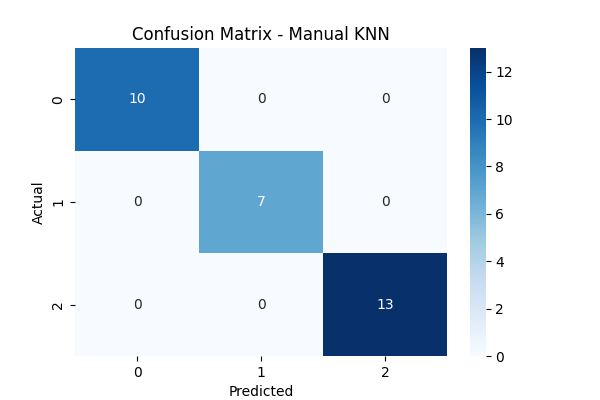
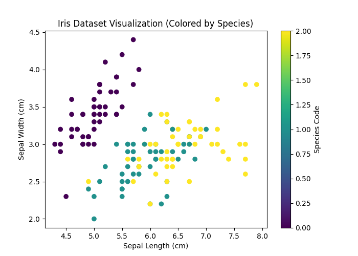

# K-Nearest Neighbors (KNN) on Iris Dataset

  

  

## Introduction

This project implements the K-Nearest Neighbors (KNN) classification algorithm on the Iris dataset.

The implementation includes:

1. Manual KNN (without using sklearn)
2. KNN using sklearn library
3. Confusion Matrix visualization
4. Accuracy comparison
5. Data visualization using scatter plot

The goal is to classify Iris flowers into three species:
- Setosa
- Versicolor
- Virginica

---

# Dataset: Iris

Features used:
- Sepal Length (cm)
- Sepal Width (cm)
- Petal Length (cm)
- Petal Width (cm)

Target:
- Species (encoded into numeric values)

Dataset is shuffled and split into:
- 80% Training data
- 20% Testing data

---

# Algorithm: Manual KNN Classification

## Input:
    D = Training dataset
    X_new = New test sample
    K = Number of neighbors (K = 3)

## Output:
    Predicted class label

---

## Steps:

1. Shuffle dataset and split into training and testing sets.

2. For each test sample:

       a. Compute Euclidean distance from all training samples:

              distance = √ Σ (Xi − X_new)²

       b. Sort distances in ascending order.

       c. Select first K nearest neighbors.

       d. Extract their class labels.

       e. Perform majority voting:

              Predicted Class = most common label among K neighbors

3. Compare predicted label with actual label.

4. Construct confusion matrix.

5. Compute accuracy:

       Accuracy = (Correct Predictions / Total Test Samples) × 100

---

# KNN using sklearn

Steps:

1. Split dataset using train_test_split().
2. Create model:

       model = KNeighborsClassifier(n_neighbors=3)

3. Train model using:

       model.fit(X_train, y_train)

4. Predict using:

       y_pred = model.predict(X_test)

5. Compute accuracy using:

       accuracy_score(y_test, y_pred)

---

# Evaluation Metrics

- Accuracy (Manual)
- Accuracy (Sklearn)
- Confusion Matrix
- Heatmap Visualization

---

# Visualization

1. Confusion Matrix plotted using seaborn heatmap.
2. Scatter plot of Iris dataset using Sepal Length and Sepal Width.
3. Color-coded visualization based on species.

---

# Time Complexity

Manual KNN:

Training:
    O(1)   (lazy learning)

Prediction:
    O(n × m)

Where:
- n = number of training samples
- m = number of features

Sklearn KNN:
    Similar time complexity O(n × m)

---

# Space Complexity

    O(n × m)

Dataset is stored entirely in memory.

---

# Key Observations

- Manual implementation produces results similar to sklearn model.
- Accuracy depends on value of K.
- KNN performs well on small, structured datasets like Iris.
- Feature scaling can improve performance.

---

# Conclusion

KNN is a simple and powerful classification algorithm based on distance measurement and majority voting.

This project demonstrates:
- Manual implementation understanding
- Library-based implementation
- Performance comparison
- Visualization of classification results

It is suitable for educational and small-scale classification tasks.
