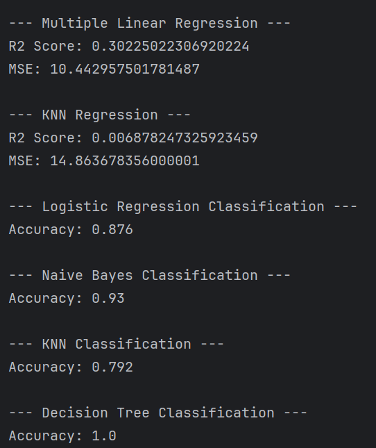

# Student Academic Placement Performance - Machine Learning Models

## Introduction

This project applies multiple Machine Learning algorithms on a student academic placement dataset to perform:

1. Regression Task → Predict salary package (LPA)
2. Classification Task → Predict placement status

Both regression and classification models are implemented using scikit-learn.

---

# Dataset Overview

Dataset: Student Academic Placement Performance

Target Variables:
- salary_package_lpa → Regression target
- placement_status → Classification target

Removed Columns:
- student_id (identifier column)

Categorical columns are encoded using LabelEncoder.

Dataset is split into:
- 80% Training data
- 20% Testing data

---

# Preprocessing Steps

1. Load dataset using pandas.
2. Identify categorical columns.
3. Encode categorical columns using LabelEncoder.
4. Separate regression and classification targets.
5. Drop ID and target columns from feature set.
6. Split dataset using train_test_split().

---

# Models Implemented

## 1️⃣ Multiple Linear Regression

Used for predicting salary package.

Model:
    LinearRegression()

Evaluation Metrics:
- R2 Score
- Mean Squared Error (MSE)

---

## 2️⃣ KNN Regression

Model:
    KNeighborsRegressor(n_neighbors=5)

Evaluation Metrics:
- R2 Score
- Mean Squared Error (MSE)

---

## 3️⃣ Logistic Regression (Classification)

Used to predict placement status.

Model:
    LogisticRegression(max_iter=1000)

Evaluation Metric:
- Accuracy

---

## 4️⃣ Naive Bayes Classifier

Model:
    GaussianNB()

Evaluation Metric:
- Accuracy

---

## 5️⃣ KNN Classifier

Model:
    KNeighborsClassifier(n_neighbors=5)

Evaluation Metric:
- Accuracy

---

## 6️⃣ Decision Tree Classifier

Model:
    DecisionTreeClassifier()

Evaluation Metric:
- Accuracy

---

# Model Workflow

For each model:

1. Initialize model.
2. Fit model using training data.
3. Predict using testing data.
4. Evaluate using appropriate metric.

---

# Evaluation Metrics Used

Regression:
- R2 Score
- Mean Squared Error (MSE)

Classification:
- Accuracy Score

---

# Time Complexity

Linear Regression:
    O(nm)

KNN:
    Training → O(1)
    Prediction → O(nm)

Logistic Regression:
    O(nm)

Naive Bayes:
    O(nm)

Decision Tree:
    O(n log n)

Where:
- n = number of samples
- m = number of features

---

---

# Model Results Snapshot

  

---

# Key Observations

- Linear Regression predicts salary package.
- Logistic Regression, Naive Bayes, KNN, and Decision Tree predict placement status.
- Different models show varying performance depending on dataset characteristics.
- Feature encoding is essential for machine learning models.

---

# Conclusion

This project demonstrates:

- Data preprocessing and encoding
- Regression and classification modeling
- Performance comparison of multiple algorithms
- Practical machine learning workflow using scikit-learn

It provides a comprehensive understanding of applying ML algorithms to real-world academic performance data.
