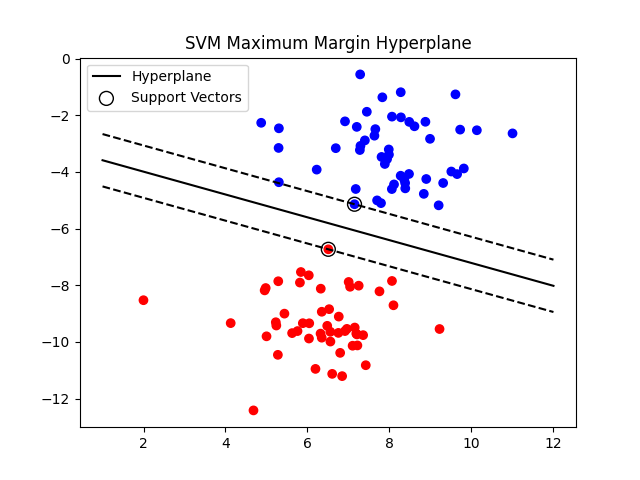

# Support Vector Machine (SVM) - Maximum Margin Hyperplane

  

## Introduction

Support Vector Machine (SVM) is a supervised machine learning algorithm used for classification and regression tasks.

In classification, SVM finds the optimal hyperplane that separates data points of different classes with the maximum possible margin.

This project demonstrates:

- Generating a 2D dataset
- Training a Linear SVM model
- Extracting hyperplane parameters
- Visualizing decision boundary
- Plotting margin lines
- Highlighting support vectors

---

# Dataset Generation

The dataset is generated using:

    datasets.make_blobs()

Parameters:
- n_samples = 100
- centers = 2 (binary classification)
- cluster_std = 1.2

This creates a 2D linearly separable dataset.

---

# Algorithm: Support Vector Machine (Linear Kernel)

## Input:
    X = Feature matrix (2D points)
    y = Class labels
    kernel = 'linear'

## Output:
    Optimal hyperplane
    Support vectors

---

## Steps:

1. Generate dataset using make_blobs().

2. Initialize SVM model:

       model = SVC(kernel='linear')

3. Train model:

       model.fit(X, y)

4. Extract hyperplane parameters:

       w = model.coef_[0]
       b = model.intercept_[0]

5. Decision boundary equation:

       w1x1 + w2x2 + b = 0

   Rearranged form:

       x2 = -(w1x1 + b) / w2

6. Compute margin:

       margin = 1 / ||w||

7. Plot:
   - Data points
   - Decision boundary
   - Margin lines
   - Support vectors

---

# Mathematical Concept

SVM maximizes margin:

       Margin = 2 / ||w||

Optimization Objective:

       Minimize (1/2)||w||²
       Subject to: yi(w·xi + b) ≥ 1

Where:
- w = weight vector
- b = bias
- xi = data points
- yi = class labels

---

# Visualization Components

- Decision Boundary → Solid black line
- Margins → Dashed lines
- Support Vectors → Circled points
- Data Points → Colored by class

Support vectors are the critical points that define the hyperplane.

---

# Time Complexity

Training:
    O(n²) to O(n³)

Where:
- n = number of samples

Prediction:
    O(n)

---

# Space Complexity

    O(n)

---

# Key Observations

- SVM selects only support vectors to define decision boundary.
- Margin maximization improves generalization.
- Linear kernel works well for linearly separable data.
- Hyperplane equation can be derived directly from model parameters.

---

# Conclusion

This project demonstrates the geometric intuition behind Support Vector Machines.

It visualizes:
- Maximum margin hyperplane
- Support vectors
- Margin boundaries

SVM is widely used in text classification, image recognition, and high-dimensional classification problems.
