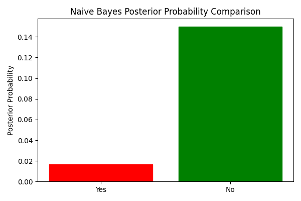
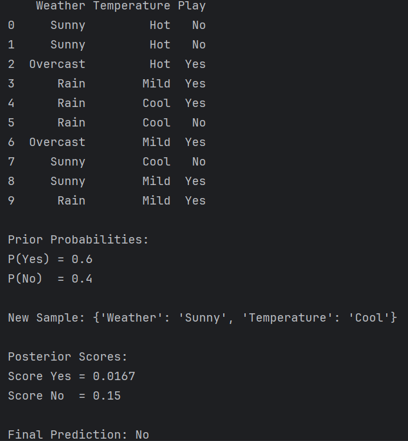

# Naïve Bayes Classifier (Yes/No Classification)

  

## Introduction

Naïve Bayes is a supervised machine learning algorithm based on Bayes’ Theorem.
It is mainly used for classification problems.

The algorithm assumes that all features are conditionally independent given the class label.

Despite this strong assumption, Naïve Bayes performs very well in many real-world problems such as spam detection, medical diagnosis, and sentiment classification.

---

# Algorithm: NaiveBayes

## Input:
    D = Training dataset with features and class labels {Yes, No}
    X = New sample with feature values

## Output:
    Predicted class (Yes or No)

---

## Steps:

1. Compute total number of training samples:
       N ← total number of records in D

2. Count class occurrences:
       N_yes ← number of records labeled Yes
       N_no  ← number of records labeled No

3. Compute prior probabilities:
       P(Yes) ← N_yes / N
       P(No)  ← N_no  / N

4. For each feature Fi in dataset D:
       For each possible value v of Fi:
            Compute likelihood probabilities:
                 P(Fi = v | Yes)
                 P(Fi = v | No)

       If any probability becomes zero, apply Laplace smoothing:

            P(Fi = v | Yes) ← (Count(Fi=v in Yes) + 1) / (N_yes + k)
            P(Fi = v | No)  ← (Count(Fi=v in No)  + 1) / (N_no  + k)

       where k = number of possible values of feature Fi

5. Initialize class scores:
       scoreYes ← P(Yes)
       scoreNo  ← P(No)

6. For each feature Fi in sample X:
       scoreYes ← scoreYes × P(Fi = Xi | Yes)
       scoreNo  ← scoreNo  × P(Fi = Xi | No)

7. Compare scores:
       If scoreYes > scoreNo
            return Yes
       Else
            return No

---

## Mathematical Formula

Bayes’ Theorem:

       P(C | X) = (P(X | C) × P(C)) / P(X)

Since P(X) is constant for both classes:

       P(C | X) ∝ P(X | C) × P(C)

---

## Time Complexity

Training:
       O(n × m)

Prediction:
       O(m)

Where:
- n = number of training samples
- m = number of features

---

## Space Complexity

       O(n × m)

---

  

## Conclusion

Naïve Bayes is a simple, fast, and efficient probabilistic classifier.
It works well for categorical Yes/No classification problems and high-dimensional datasets.
